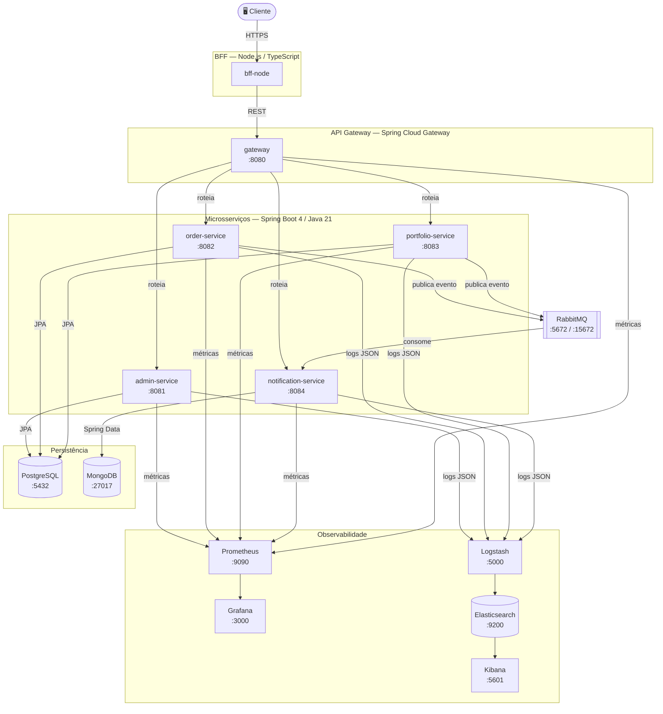
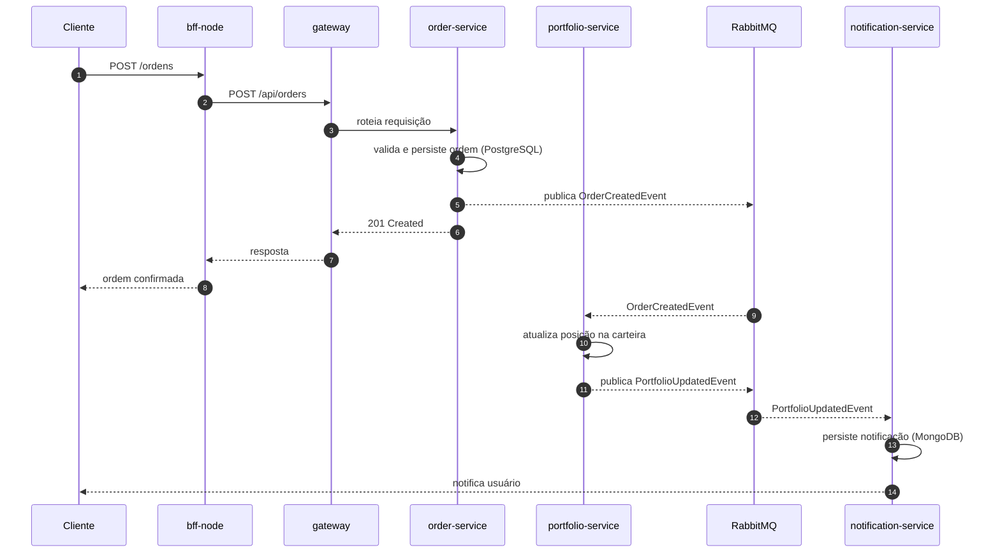

# InvestTrack

> Plataforma de acompanhamento de carteira e produtos de investimento


---

## Sumário

- [Visão Geral](#visão-geral)
- [Arquitetura](#arquitetura)
- [Serviços](#serviços)
- [Infraestrutura](#infraestrutura)
- [Como executar](#como-executar)
- [Decisões de Arquitetura (ADRs)](#decisões-de-arquitetura-adrs)

---

## Visão Geral

O **InvestTrack** é uma plataforma backend construída com arquitetura de microsserviços para gerenciar carteiras de investimento, ordens de compra e venda, notificações e administração de produtos financeiros.

### Stack principal

| Camada | Tecnologia |
|---|---|
| Linguagem (backend) | Java 21 |
| Framework | Spring Boot 4 |
| BFF | Node.js + TypeScript 6 |
| Banco relacional | PostgreSQL 14 |
| Banco documental | MongoDB 8 |
| Mensageria | RabbitMQ 4 |
| Gateway | Spring Cloud Gateway |
| Métricas | Prometheus + Grafana |
| Logs | ELK (Elasticsearch + Logstash + Kibana) |

---

## Arquitetura

### Diagrama de Componentes



### Fluxo de uma Ordem de Investimento



---

## Serviços

| Serviço | Responsabilidade | Banco | Porta |
|---|---|---|---|
| `gateway` | Roteamento, autenticação, rate limiting | Redis | 8080 |
| `admin-service` | Gestão de produtos e usuários, integração SOAP | PostgreSQL | 8081 |
| `order-service` | Criação e rastreamento de ordens | PostgreSQL | 8082 |
| `portfolio-service` | Consolidação de carteiras e posições | PostgreSQL | 8083 |
| `notification-service` | Notificações assíncronas por evento | MongoDB | 8084 |
| `bff-node` | Agregação e adaptação para o cliente | — | 3001 |

---

## Infraestrutura

| Serviço | Imagem | Porta(s) | Finalidade |
|---|---|---|---|
| PostgreSQL | `postgres:14.22` | 5432 | Dados transacionais |
| MongoDB | `mongo:8.3.1` | 27017 | Notificações |
| RabbitMQ | `rabbitmq:4.3.0-management-alpine` | 5672 / 15672 | Mensageria |
| Prometheus | `prom/prometheus:latest` | 9090 | Coleta de métricas |
| Grafana | `grafana/grafana:latest` | 3000 | Dashboards |
| Elasticsearch | `elastic:8.13.4` | 9200 | Indexação de logs |
| Logstash | `elastic:8.13.4` | 5000 / 5044 | Pipeline de logs |
| Kibana | `elastic:8.13.4` | 5601 | Visualização de logs |

### Estrutura de arquivos de infra

```
infra/
├── prometheus/
│   └── prometheus.yml
├── grafana/
│   └── provisioning/
└── logstash/
    ├── config/logstash.yml
    └── pipeline/logstash.conf
```

---

## Como executar

### Pré-requisitos

- [Docker](https://www.docker.com/) 24+
- [Docker Compose](https://docs.docker.com/compose/) v2+
- [Java 21](https://adoptium.net/)
- [Node.js 22+](https://nodejs.org/)

### 1. Variáveis de ambiente

Crie um arquivo `.env` na raiz a partir do exemplo:

```bash
cp .env.example .env
```

Valores disponíveis para sobrescrever:

```env
POSTGRES_USER=investtrack
POSTGRES_PASSWORD=investtrack
POSTGRES_DB=investtrack

MONGO_USER=investtrack
MONGO_PASSWORD=investtrack
MONGO_DB=investtrack

RABBITMQ_USER=investtrack
RABBITMQ_PASSWORD=investtrack

GRAFANA_USER=admin
GRAFANA_PASSWORD=admin
```

### 2. Subir a infraestrutura

```bash
docker compose up -d
```

### 3. Executar os microsserviços

Cada serviço pode ser executado individualmente:

```bash
# Exemplo para order-service
cd order-service
./mvnw spring-boot:run
```

### 4. Executar o BFF

```bash
cd bff-node
npm install
npm run dev
```

### Interfaces disponíveis

| Interface | URL |
|---|---|
| RabbitMQ Management | http://localhost:15672 |
| Prometheus | http://localhost:9090 |
| Grafana | http://localhost:3000 |
| Kibana | http://localhost:5601 |

---

## Decisões de Arquitetura (ADRs)

Os ADRs documentam as principais decisões técnicas tomadas no projeto. Cada arquivo segue o formato padrão: contexto → decisão → consequências.

| # | Decisão | Status |
|---|---|---|
| [ADR-001](docs/adr/ADR-001-arquitetura-microsservicos.md) | Adotar arquitetura de microsserviços | ✅ Aceito |
| [ADR-002](docs/adr/ADR-002-api-gateway-spring-cloud.md) | API Gateway com Spring Cloud Gateway | ✅ Aceito |
| [ADR-003](docs/adr/ADR-003-persistencia-poliglota.md) | Persistência poliglota: PostgreSQL + MongoDB | ✅ Aceito |
| [ADR-004](docs/adr/ADR-004-comunicacao-assincrona-rabbitmq.md) | Comunicação assíncrona com RabbitMQ | ✅ Aceito |
| [ADR-005](docs/adr/ADR-005-bff-nodejs-typescript.md) | BFF em Node.js com TypeScript | ✅ Aceito |
| [ADR-006](docs/adr/ADR-006-observabilidade-elk-prometheus.md) | Observabilidade com ELK + Prometheus/Grafana | ✅ Aceito |

---

## Estrutura do repositório

```
InvestTrack/
├── gateway/                  # API Gateway (Spring Cloud Gateway)
├── admin-service/            # Serviço de administração
├── order-service/            # Serviço de ordens
├── portfolio-service/        # Serviço de carteiras
├── notification-service/     # Serviço de notificações
├── bff-node/                 # Backend For Frontend (Node.js)
├── infra/                    # Configurações de infraestrutura
│   ├── prometheus/
│   ├── grafana/
│   └── logstash/
├── docs/
│   └── adr/                  # Architecture Decision Records
├── docker-compose.yml
└── README.md
```

---

## Licença

Este projeto é de uso educacional.
